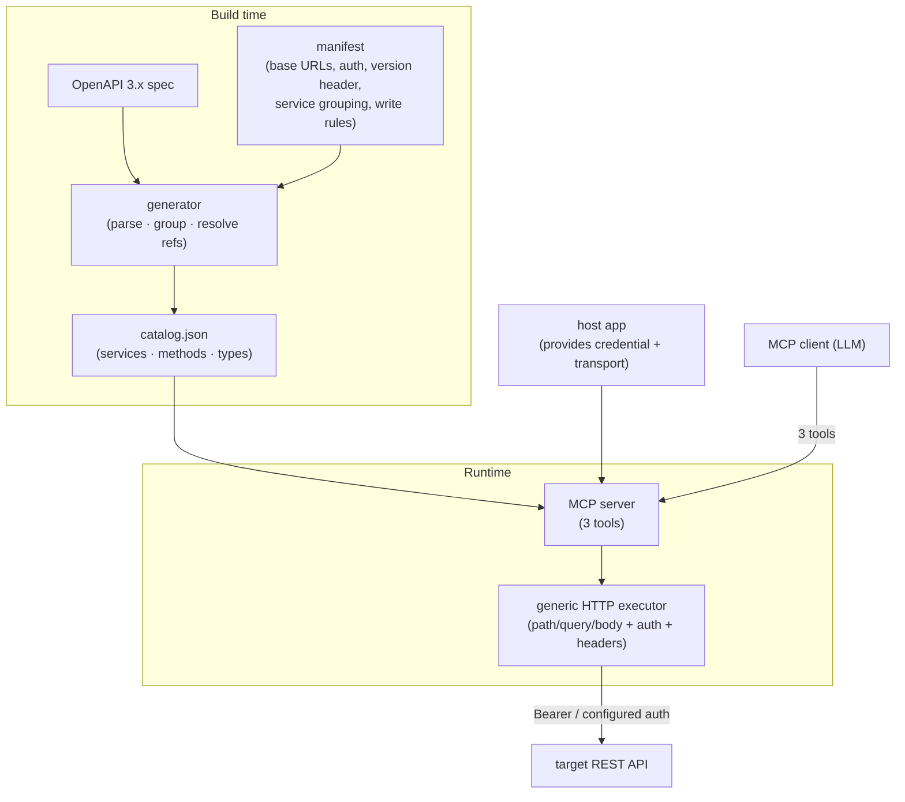

# OpenAPI → MCP generator (Go)

A standalone library + tool that turns **any OpenAPI 3.x spec** into an MCP
server exposing a small, constant set of generic tools — instead of one tool per
endpoint. Prior art: Square's [`square-mcp-server`](https://github.com/square/square-mcp-server)
(TypeScript). This is a generalized Go implementation.

Home: `git@github.com:neosh11/MCPs.git`

It is an **abstraction**: a host application provides a generated catalog, a base
URL, and a credential provider, and gets a working MCP server. Nothing about how
or where it's hosted is baked in.

---

## 1. Why

A large REST API has hundreds of endpoints. Exposing one MCP tool per endpoint
floods the model's context and is unusable. Instead, expose **three** generic
tools and let the model discover and call operations on demand:

| Tool | Input | Returns |
|---|---|---|
| `get_service_info` | `service` | the service's methods → short descriptions |
| `get_type_info` | `service`, `method` | the method's request schema (fields, types, required) |
| `make_api_request` | `service`, `method`, `request` | executes the call, returns the response |

Tool count is constant regardless of API size. Schemas are served **lazily** —
`get_type_info` returns one type at a time, so a huge type universe never enters
context wholesale.

---

## 2. Shape

Two halves: a **build-time generator** (spec → catalog) and a **runtime server**
(catalog + config → MCP). The catalog is plain data — there is **no per-endpoint
code generation**; one generic executor drives every operation.



---

## 3. Catalog data model

The single artifact the generator emits and the runtime consumes:

```jsonc
{
  "api":   { "name": "Square", "description": "...", "specVersion": "2025-04-16" },
  "services": {
    "locations": {
      "name": "Locations", "description": "...",
      "methods": {
        "get": {
          "description": "Retrieve details of a location...",
          "httpMethod": "get",
          "path": "/v2/locations/{location_id}",
          "pathParams":  [{ "name": "location_id", "type": "string", "required": true, "description": "..." }],
          "queryParams": [],
          "requestType": "RetrieveLocationRequest",
          "isWrite": false,
          "isMultipart": false
        }
      }
    }
  },
  "types": {
    "RetrieveLocationRequest": {
      "name": "RetrieveLocationRequest",
      "properties": [
        { "name": "location_id", "type": "string", "description": "...", "required": true, "readOnly": false, "arrayType": null }
      ]
    }
  }
}
```

- **services** group operations (by OpenAPI tag, overridable).
- **methods** carry everything the executor needs: verb, path, params, the request-type name, and an `isWrite` flag.
- **types** map a request-type name → flattened properties (one level; nested objects reference their own type name, fetched via a follow-up `get_type_info`).

Catalogs are checked in and reviewable; the spec is pinned so generation is offline and reproducible.

---

## 4. Generator

A CLI (`openapi-mcp-gen`) using a solid OpenAPI-3 parser (e.g. `pb33f/libopenapi`).

**Manifest (per API):**
```jsonc
{
  "name": "square",
  "spec": "specs/square.json",
  "baseUrls": { "default": "https://connect.squareup.com",
                "sandbox": "https://connect.squareupsandbox.com" },
  "auth": "bearer",
  "headers": { "Square-Version": "2025-04-16" },
  "serviceFrom": "tag",
  "methodKey": "operationIdVerb",
  "writeMethods": ["post", "put", "patch", "delete"]
}
```

**Pipeline:** parse → group operations into services → derive a short method key
per operation (`list`/`get`/`create`/`update`/`delete`/`search`…) → extract verb,
path, path/query params, request body → request-type, `isMultipart`, `isWrite` →
resolve `components/schemas` into flat property lists → emit deterministic
`catalog.json`. Refreshing the spec is an explicit, diffable step.

---

## 5. Runtime

A generic MCP server, agnostic to which API the catalog describes.

- `ListTools` → the three tools, with fixed JSON schemas. `make_api_request`'s
  description enumerates available services so discovery needs no guessing.
- `get_service_info(service)` → `catalog.services[service].methods` (names + descriptions).
- `get_type_info(service, method)` → `catalog.types[method.requestType]`.
- `make_api_request(service, method, request)` → the **executor**:
  1. fill declared path params into `path` (error on a missing required one);
  2. declared query params → query string;
  3. remaining fields → JSON body for write verbs;
  4. issue the HTTP request to `baseURL + path` with the configured auth + headers;
  5. non-2xx → tool error carrying the API's error body; 2xx → response text.

The executor is written once and is identical for every API.

---

## 6. Extension points (the abstraction)

The host wires these in — nothing else is assumed:

- **Catalog** — generated; embedded or loaded at startup.
- **Credential provider** — `func(ctx) (token, error)`. The library never decides where secrets live; it just asks for a token per request. (Supports per-caller/per-tenant tokens.)
- **Base URL selection** — static, or chosen per environment (e.g. sandbox vs production).
- **Transport** — stdio, HTTP/SSE, or an in-process handler. The 3-tool logic is transport-independent.
- **Read-only mode** — when set, `make_api_request` rejects `isWrite` methods. Sensible default for untrusted callers.
- **Request hook** (optional) — observe/deny a call before it executes (audit, allowlists, rate limits).

A minimal embedding: `server := openapimcp.New(catalog, openapimcp.Config{ BaseURL, Auth: credProvider, ReadOnly: true }); server.ServeStdio(ctx)`.

---

## 7. Reusability

Adding an API is **data only**: drop its spec + a manifest, regenerate the
catalog, construct a server with the right base URL and credential provider. No
per-endpoint code, one executor, one tool surface. The same binary can host
several catalogs side by side (one MCP server per API, or a multiplexer).

---

## 8. Module layout

The repo (`MCPs`) is a monorepo for MCP servers/tools; the OpenAPI→MCP generator
is its first module:

```
MCPs/
  openapi-mcp/
    cmd/openapi-mcp-gen/    # generator CLI: spec + manifest -> catalog.json
    catalog/                # catalog types + (de)serialization
    server/                 # generic MCP server: 3 tools over a catalog
    exec/                   # HTTP executor (path/query/body, auth, headers)
    specs/ manifests/ catalogs/   # pinned inputs + generated outputs
    examples/square/        # reference embedding (Square sandbox)
```

Square is the first catalog and the worked example; the rest of the module is
API-agnostic.

---

## 9. Roadmap

1. Catalog schema + generic 3-tool server over a small hand-written catalog (lock the data contract; verify against a live sandbox).
2. Generator: spec + manifest → catalog; regenerate Square from its published OpenAPI.
3. Safety + parity: read-only gate, service enumeration in tool descriptions, request hook.
4. Second API to prove reuse; publish as a tagged Go module.

---

## 10. Open questions

- **Method-key naming** — derive stable short keys from `operationId`; allow manifest overrides for awkward cases.
- **Type depth** — flatten one level (as the reference does) vs. inline N levels; one level keeps payloads small and relies on follow-up `get_type_info`.
- **Spec source** — pin a published OpenAPI per API; confirm service/method names match what users expect, remap via the manifest where they don't.
- **Auth beyond bearer** — bearer covers the first cases; the credential provider interface leaves room for header/query-key or OAuth token exchange later.
